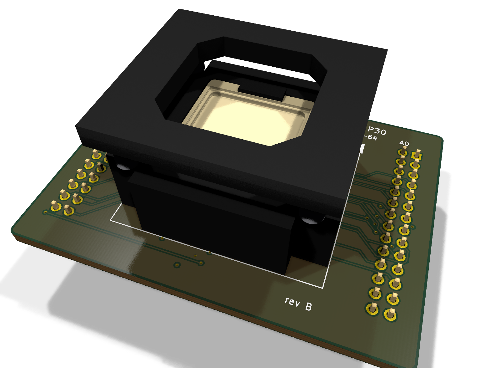
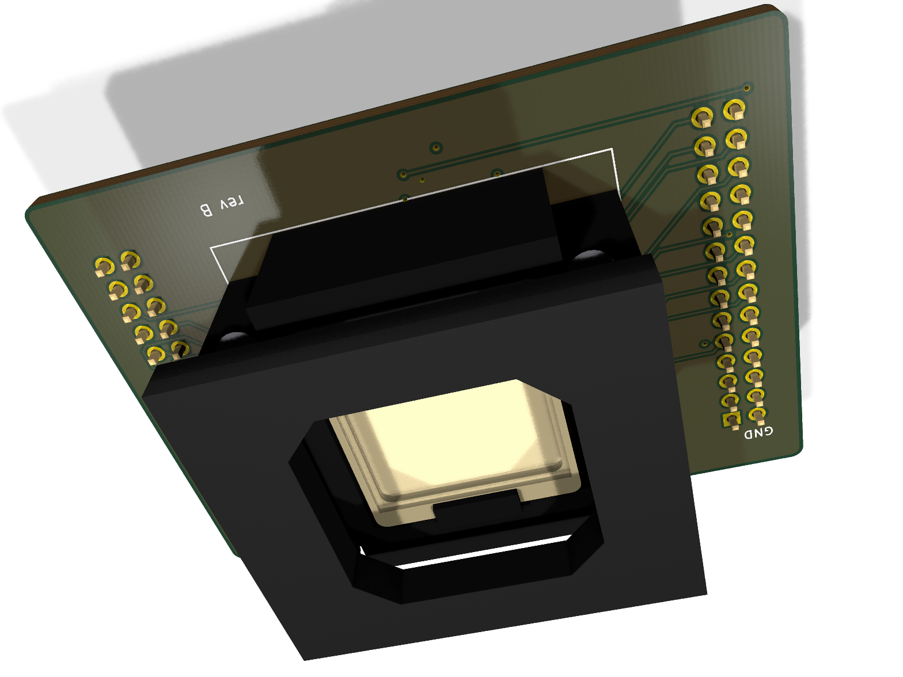
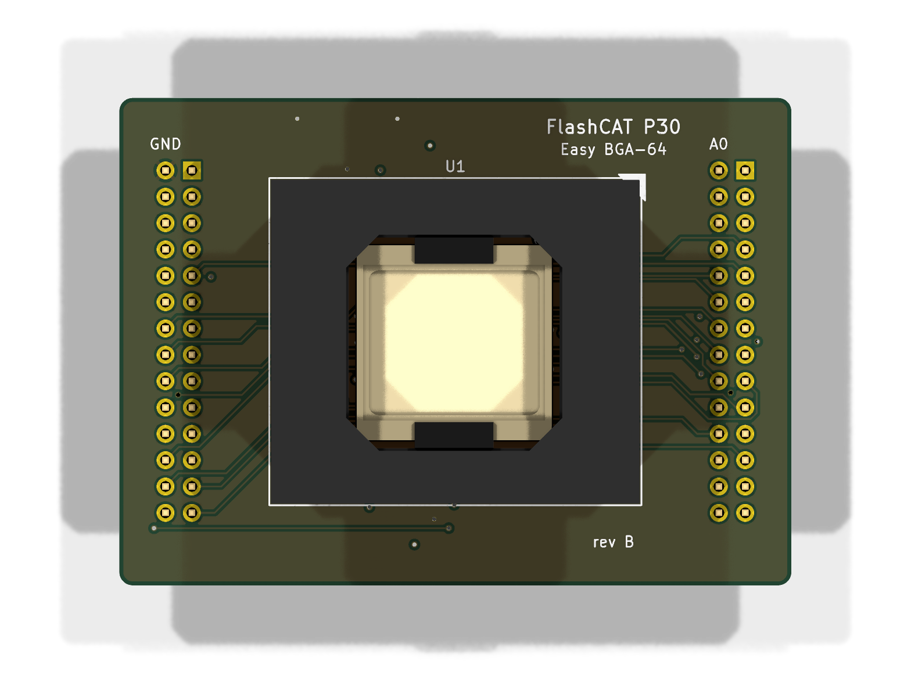
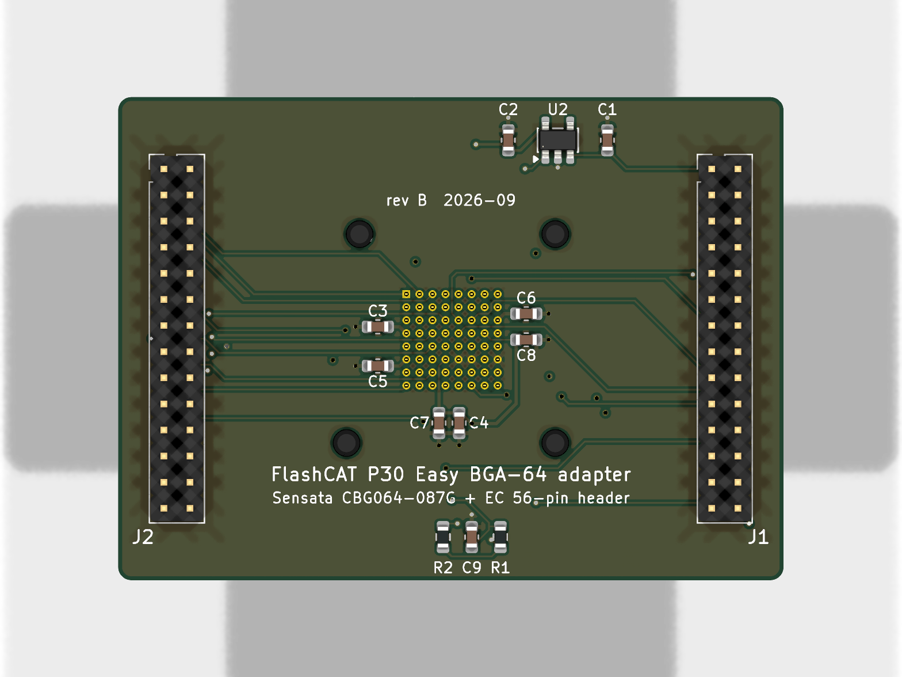
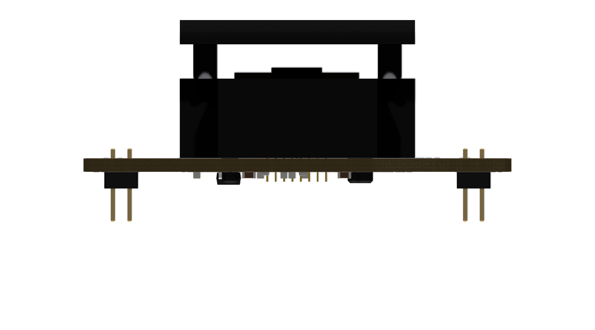
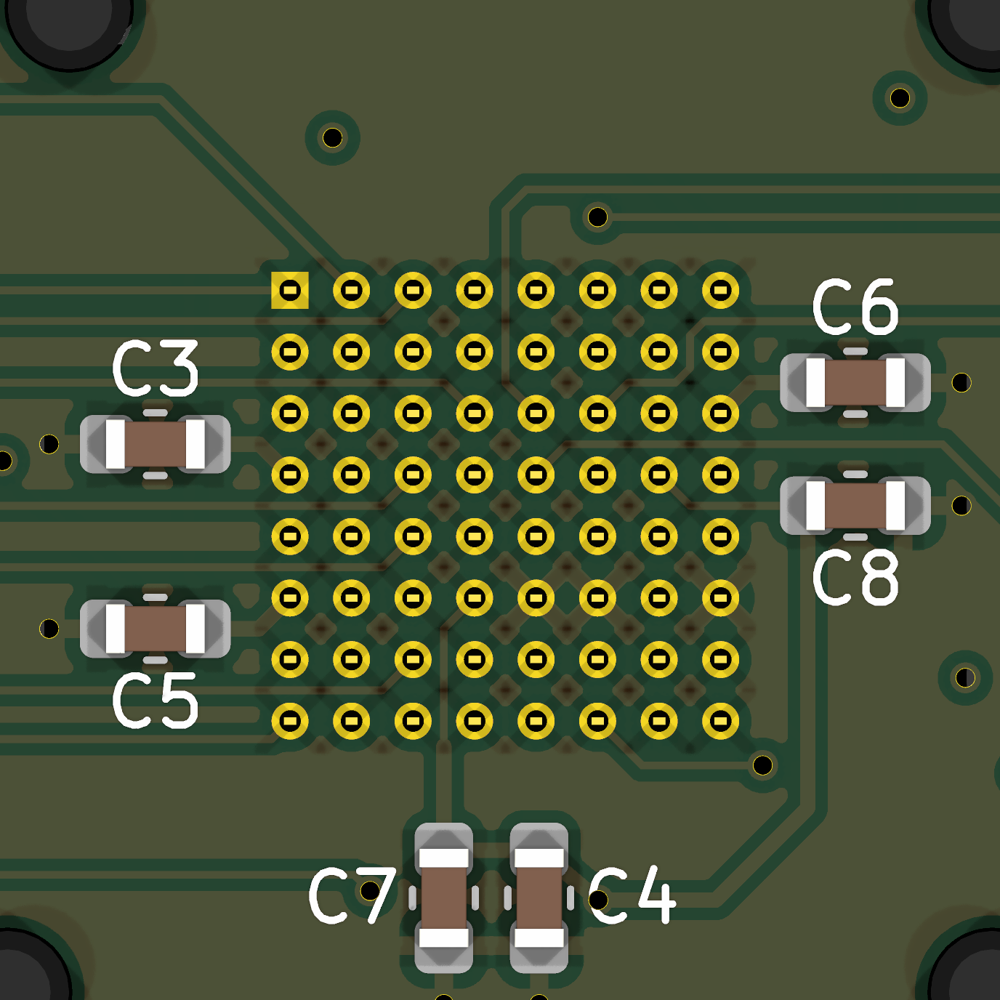
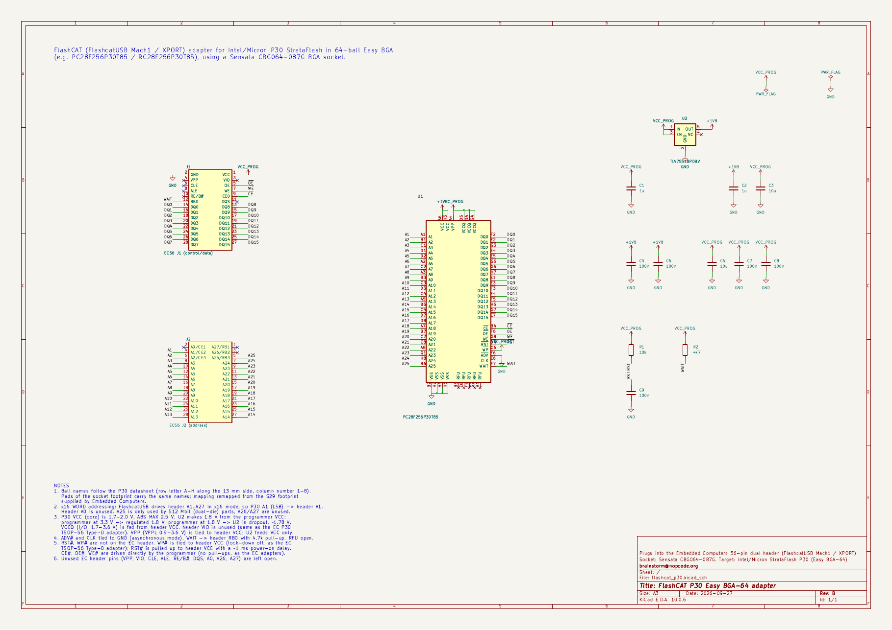

# FlashCAT P30 Easy BGA-64 adapter

KiCad 10 project for a FlashcatUSB (Mach1 / XPORT) parallel adapter that reads
and writes **Intel / Micron StrataFlash P30** parallel NOR in the **64-ball
Easy BGA** package (e.g. `PC28F256P30T85`, `RC28F256P30T85`; the `JS28F…`
parts are TSOP-56 and need the TSOP adapter instead), using a **Sensata CBG064-087G** open-top
burn-in socket, as discussed with Embedded Computers (thread "256P30T",
Oct 2020 – Feb 2021).

| Top (socket) | Bottom (all SMD parts) |
|---|---|
|  |  |
|  |  |

| Side | Decoupling at the socket balls (bottom) |
|---|---|
|  |  |



Schematic as PDF: [`fab/docs/schematic.pdf`](fab/docs/schematic.pdf) ·
Gerbers: [`fab/flashcat_p30-gerbers.zip`](fab/flashcat_p30-gerbers.zip)

```
hardware/
  flashcat_p30.kicad_pro / .kicad_sch / .kicad_pcb   the project
  lib/flashcat_p30.kicad_sym                         P30 socket, EC header, LDO, R, C, power symbols
  lib/flashcat_p30.pretty/Sensata_CBG064-087G        socket footprint, pads named with P30 ball names
  lib/flashcat_p30.3dshapes/Sensata_CBG064-087G.step socket 3D model (built from the Sensata drawing)
  fab/                                               gerbers (+zip), drill, BOM, CPL, PDFs
  renders/                                           3D renders, schematic preview, sheet view
  tools/                                             generators + checks (source of truth: design.py)
```

## What the board does

| P30 ball(s) | Signal | Connected to |
|---|---|---|
| A1…A25 | address (A1 = LSB, word address) | EC header **A1…A25** (header A0 unused) |
| DQ0…DQ15 | data | EC header DQ0…DQ15 |
| CE#, OE#, WE# | control | EC header CE0, OE, WE (driven directly, no pull-ups) |
| RST# | reset | 10k to VCC + 100 nF to GND (~1 ms power-on reset) |
| WP# | write protect | tied to header VCC (lock-down disabled) |
| ADV#, CLK | sync-burst inputs | GND (asynchronous mode, per datasheet) |
| WAIT | wait/ready | EC header **RB0**, 4.7k pull-up to VCC |
| RFU | – | open |
| VCC ×2 | core 1.7–2.0 V | **+1V8** from U2 (TLV75518) – the LDO feeds only these |
| VPP | program/erase supply | header **VCC** (3.3 V) |
| VCCQ ×3 | I/O 1.7–3.6 V | header **VCC** (header VIO unused) |
| VSS ×4 | ground | GND |

Why these choices — cross-checked against the author's own **TSOP-56 Type-D**
adapter ("Supports P30 and P33 Strataflash devices such as 28F256P30",
schematic [`SCM_TSOP56_D.png`](https://www.embeddedcomputers.net/products/ParallelAdapters/SCM_TSOP56_D.png) on the [EC parallel adapters page](https://www.embeddedcomputers.net/products/ParallelAdapters/)):

| | EC TSOP-56 Type-D (P30) | this board |
|---|---|---|
| Core VCC | **MIC5504 1.8 V LDO** from header VCC, 3 × 1 µF | TLV75518 1.8 V LDO (same SOT-23-5 pinout; MIC5504-1.8YM5 is a drop-in) |
| VCCQ | header VCC | header VCC |
| Header VIO | unused | unused |
| WAIT | → RB0, 4.7k pull-up to VCC | same |
| CLK, ADV# | GND | GND |
| WP# | tied to VCC | tied to VCC |
| RST# | tied to VCC | 10k pull-up to VCC + 100 nF (~1 ms power-on reset) |
| TSOP pin 13 (2nd VCC) / pin 28 (VSS) | wired to header A27/RB1 and A26/RB2 (see note) | n/a: both Easy BGA VCC balls on the LDO, all VSS balls on GND |
| VPP | VCC rail | header VCC |
| CE#, WE# pull-ups | none | none |
| Address | P30 A1 → header A1/CE2 … A25 → A25/RB3 | same |

* **Verified in the Type-D schematic:** header VCC (pin 28) → MIC5504 VIN and
  EN, VOUT (P$5) → C3 1 µF → TSOP pin 33 **VCC**, part marked "1.8V LDO".
  Note: on that drawing TSOP pin 13 (the P30's second VCC pin) is labelled
  `VCC_A27` and routed to header A27/RB1, and pin 28 (VSS on P30) to header
  A26/RB2 – i.e. they are presumably driven by the firmware (or the symbol is
  shared with another 28F variant). This board does not copy that; it follows
  the P30 datasheet. Worth confirming with the author.
* **Is the LDO needed? Yes.** None of the other EC adapters carry a regulator
  because they are all for 3 V (or 5 V) core parts; the only adapter on the
  page with an LDO is the P30 one, for exactly the reason below. (The other
  small ICs on those schematics are a VPP load switch on DIP-40 and
  push-pull/open-drain MOSFETs on BGA-153, not regulators.)

* **Addressing**: the FlashcatUSB firmware/software drives the header in x16 NOR
  mode as *"Addressing is done A1-A27 (WORD ADDR)"* (`Parallel_NOR_NAND.vb`,
  `E_EXPIO_WRADDR.Parallel_X16`). P30 names its LSB `A1`, so `An` → header
  `An` — the "same pin connection as the TSOP56" the author mentioned.
  A25 is wired so 512 Mbit dual-die P30 parts work too.
* **Core voltage**: P30 `VCC` is 1.7–2.0 V with an **absolute maximum of 2.5 V**,
  while the header VCC runs at 3.3 V for these adapters (the author's MIC5504
  needs ≥ 2.5 V in, so their design assumes 3.3 V too). Wiring `VCC` straight
  to the header would destroy the chip. U2 (TLV755P, 1.45–5.5 V input) was
  kept over the MIC5504 because it also survives a 1.8 V programmer setting:
  it just drops out and passes ~1.78 V through.
* **VPP** goes to header VCC (3.3 V), like the author's adapter. VPPL is
  0.9–3.6 V, but program/erase timings are specified at the higher end, and
  this keeps the LDO dedicated to the core VCC balls. The header's VPP pin (which can carry 12 V for old EPROMs)
  is deliberately left unconnected.

## Mechanical / geometry

* Board: 51 × 37 mm, 4 layers, 1.6 mm, rounded corners.
  Stack: F.Cu signals + GND pour · In1 solid GND plane · In2 signals + VCC
  pour · B.Cu signals + GND pour.
* BGA escape is a fixed, hand-planned fanout (`tools/fanout.py`): rings 1+2 on
  F.Cu, ring 3 on B.Cu, the centre balls on In2 (VCCQ D5 is linked to its
  VCCQ neighbour D6 instead of escaping), one 0.127 mm track per channel;
  each escape exits on the side facing its header (data → J1, address → J2);
  B.Cu channels next to A4/A6/H3/G4 are kept free for the bottom decap traces,
  and a locked B.Cu link joins the two VCCQ cap groups onto one VCC via; GND balls drop straight into the In1 plane (solid connection). The
  rest was autorouted with Freerouting and cleaned up (dangling stubs trimmed).
* EC 56-pin header: two 2×14, 2.00 mm male headers mounted from the **bottom**
  (plastic spacer between adapter and programmer), left columns 42.00 mm
  apart, positions per [`EC_56P_HEADER.png`](https://www.embeddedcomputers.net/products/ParallelAdapters/EC_56P_HEADER.png). Top-silk "GND" and "A0" mark the
  first pins; all silkscreen reads the same way as the programmer's.
* **Socket orientation:** the socket is placed rotated 180°, so pin **A1 is
  at the top-right** (silk triangle + "A1"). This puts the address-heavy
  ball columns (A–D) next to the address header J2 and the data columns
  (E–H) next to J1, which is what made the escape routable. Seat the chip
  by the A1 mark; the offset registration hole still polarises the socket.
* Socket footprint follows the **Sensata drawing CBG064-087G-3 rev A, sheet 2**:
  64 × Ø0.35 mm PTH (spec Ø0.30 +0.10/−0) with 0.60 mm pads, 4 × Ø2.10 mm
  NPTH registration holes at (±8, −8), (8, 8), (−7, 8) — the one near pin A1
  is offset 1 mm, which polarises the socket — plus the four corner keep-outs.
  **Note:** the drawing puts the contact grid 3.41 / 3.59 mm from the datum,
  i.e. offset by +0.09 mm in X and Y (away from A1). The Eagle footprint from
  Embedded Computers ignores that offset; this footprint follows the drawing.
* Ball → contact mapping: P30 letters (A–H) run along the 13 mm side, numbers
  (1–8) along the 10 mm side. Rotating the datasheet top view 90° CCW puts A1
  bottom-left with letters increasing to the right, which is exactly the
  convention of the Eagle `CBG064-087G` package (A1 at bottom-left). The pad
  *names* are therefore reused unchanged and only the **signals** were remapped
  from S29 to P30, as the author said.

## ⚠ Check before ordering

1. **Package width.** The P30 Easy BGA datasheet gives the body as
   **10 × 13 mm** (D = 10.0 mm), while the CBG064-087G adapter insert is
   made for **11 × 13 mm** parts. Balls are centred on the package, so the
   pitch and grid are right, but a 10 mm part may have ±0.5 mm of play in
   the nest. Measure your chip. If needed, ask Sensata for the matching
   adapter insert (the drawing says the insert is exchangeable, up to 11 × 15 mm).
2. **Header orientation vs. your programmer.** With your working TSOP56
   adapter, check continuity: TSOP56 pin 29 (P30 A1) should go to header pin
   "A1/CE2" (J2, left column, 2nd row), and pin 30 (CE#) to "CE0". This
   confirms both the word-address convention and the top-view pin order used here.
3. **Programmer voltage.** Select the P30 device (28F256P30T) in FlashcatUSB
   and run it the same way as the TSOP-56 Type-D adapter (3.3 V). I/O runs at
   header VCC, like the author's adapter.
4. **Do not use EC's own "BGA-64 EasyBGA (28 series)" adapter for P30.** Its
   published pinout ([`BGA64_EasyBGA_Pinout.png`](https://www.embeddedcomputers.net/products/ParallelAdapters/BGA64_EasyBGA_Pinout.png)) is the J3-style ballout
   (VPEN, STS, BYTE#, CE0–CE2, RP#): it powers the core from 3 V, leaves
   P30's ADV#/CLK/VCCQ(D5, D6) balls on RFU pins, and would over-voltage a P30
   core. That is why this custom board is needed.
5. **Clearance under the board.** The bottom carries the two headers plus all
   SMD parts (0603 and a SOT-23-5, ≤ 1.45 mm tall), inside the header spacer
   height; check nothing tall on the programmer sits under the middle of the
   adapter.

## Bill of materials

| Ref | Qty | Part | Notes |
|---|---|---|---|
| U1 | 1 | Sensata **CBG064-087G** BGA-64 1.0 mm socket | through-hole, hand/selective solder; 3D model in `lib/flashcat_p30.3dshapes/` |
| J1, J2 | 2 | 2×14 male header, **2.00 mm** pitch (e.g. Samtec TMM-114-01-G-D) | mount on bottom |
| U2 | 1 | TI **TLV75518PDBVR** (SOT-23-5) | 1.8 V LDO, 1.45 V min input; alt. Microchip MIC5504-1.8YM5 (same pinout, needs ≥ 2.5 V in) |
| C1, C2 | 2 | 1 µF 25 V X5R 0603 (GRM188R61E105KA12D) | LDO in / out, either side of U2 |
| C3 | 1 | 10 µF 10 V X5R 0603 (GRM188R61A106KE69D) | **bottom**, at ball A4 (VPP, header VCC) |
| C5, C6 | 2 | 100 nF 16 V X7R 0603 (GRM188R71C104KA01D) | **bottom**, at balls A6 / H3 (VCC, +1V8) |
| C4, C7 | 2 | 10 µF + 100 nF 0603 | **bottom**, at balls D5/D6 (VCCQ) |
| C8 | 1 | 100 nF 0603 | **bottom**, at ball G4 (VCCQ) |
| C9 | 1 | 100 nF 0603 | RST# power-on RC |
| R1 | 1 | 10 kΩ 1 % 0603 (RC0603FR-0710KL) | RST# pull-up (with C9: power-on reset) |
| R2 | 1 | 4.7 kΩ 1 % 0603 (RC0603FR-074K7L) | WAIT → RB0 pull-up |

**All SMD parts are on the bottom side** (single-sided SMD assembly; the top
carries only the socket). The socket decoupling caps (C3–C8) sit 1–2 mm
from their VCC/VCCQ/VPP balls, each with its own short trace from the ball
and its own GND via into the In1 plane; the LDO (U2) with C1/C2, the
WAIT pull-up and the RST# RC sit in the strips above/below the socket. Reflow
the bottom, then hand/selective-solder the socket and the headers. `fab/assembly/`
has a generic BOM plus JLCPCB-style `bom_jlc.csv` / `cpl_jlc.csv`; placement
coordinates are relative to the socket centre (board aux origin). Add LCSC
part numbers for your assembler before ordering. Check CPL rotations in the
assembler's preview.

## Fabrication spec

4 layers, FR-4 1.6 mm, 1 oz outer copper · min track/space 0.127/0.127 mm (power 0.2–0.25 mm) ·
vias 0.3/0.5 mm · min PTH 0.35 mm (socket contacts) · any colour, HASL or
ENIG (ENIG preferred for the fine socket holes). The 1.0 mm socket grid
leaves exactly one 0.127 mm track per channel.

## Verification status (rev B)

`tools/verify.py`: ball/header mapping 0 errors · ERC 0 · DRC 0 violations,
0 unconnected (all severities) · schematic ↔ PCB parity 0.

## Regenerating

```
cd hardware/tools
python3 gen_libs.py     # symbols + socket footprint (references the 3D model)
../build/cqenv/bin/python make_socket_3d.py   # socket STEP model (CadQuery, Python 3.12 venv)
python3 gen_pro.py      # project, rules, net classes
python3 gen_sch.py      # schematic
python3 gen_pcb.py      # placement, nets, planes, silk (from schematic netlist)
python3 route.py        # fanout + Freerouting 2.4.1 (Java 25; FR_VERSION=2.1.0 for Java 21)
                        #   + stub trim + pours + fill, retries until 0 unconnected
python3 center.py       # move board to the middle of the A4 sheet, aux/grid origin = socket centre
python3 verify.py       # mapping + ERC + DRC with schematic parity
python3 make_fab.py     # gerbers, drill, BOM, CPL, PDFs
```

`design.py` is the single source of truth for the ballout, header pinout,
socket geometry and nets. Once hand-edited in KiCad, the `.kicad_*` files
become the master copy and the generators should not be re-run.

## 3D model of the socket

No vendor or SnapEDA/TraceParts model exists for the CBG064-087G, so
`tools/make_socket_3d.py` builds a simplified STEP from the Sensata sales
drawing CBG064-087G-3: 28.0 × 24.6 mm body, 16.5 mm overall (cover up), IC
seating plane at 9.2 mm, beige 11 × 13 mm adapter nest, cover on four
springs, 64 contact blades (0.12 × 0.20 mm, tails 2.8 mm below the PCB top)
and four Ø2.0 mm registration posts (3.0 mm). Contact and post positions come
from `design.py`, so they match the footprint exactly. It is for fit/clearance
checks and renders, not a manufacturer-accurate model.

## References

* Intel StrataFlash Embedded Memory (P30) datasheet, order 306666 –
  [PDF](https://www.dataman.com/media/datasheet/Intel/P30Family.pdf)
* Sensata CBG064-087G BGA-64 socket –
  [product page](https://www.sockets-connectors.com/ic-socket/CBG064-087G-3/)
  (sales drawing CBG064-087G-3 rev A, available from Sensata / distributors)
* Embedded Computers FlashcatUSB parallel adapters (EC 56-pin header, TSOP-56
  Type-D P30 adapter) – [embeddedcomputers.net](https://www.embeddedcomputers.net/products/ParallelAdapters/)
